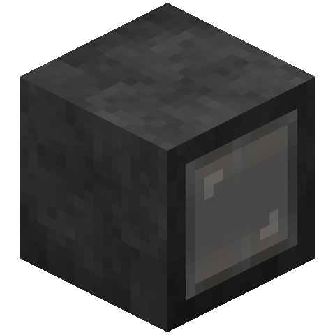

# Dark Machinations

[>> Downloads <<](https://github.com/elytra/DarkMachinations/releases)

*Technology with a bit of cocoa.*

Dark Machinations aims to be a technology mod that strikes a better balance than more traditional tech mods, while retaining the feel of playing some of these mods, and the unbridled fun of creating sprawling and impressive tech chains.

Goes well with [Correlated](https://github.com/elytra/Correlated), [Teckle](https://github.com/elytra/Teckle), and [Thermionics](https://github.com/elytra/Thermionics)!

# Balancing Against This Mod

DarkMachinations will, upon release, officially follow the Common Sense Balancing Standard (CSBS). Please read [BALANCE.md](https://gist.github.com/unascribed/14d333edc2df74e7724ae9c1b864f2f1) for more info.

------------------

## Credits and Thanks

### [Falkreon](https://github.com/Falkreon)
* Plate Textures
* Machine Textures (Generator, Crusher, Pump, Base Textures, Probably Everything Once This Mod Is Done)

